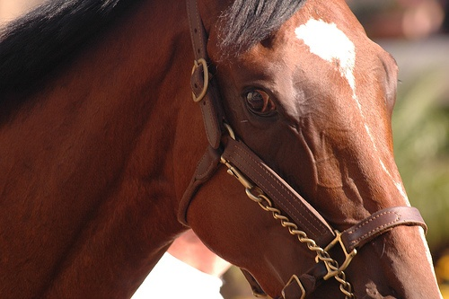
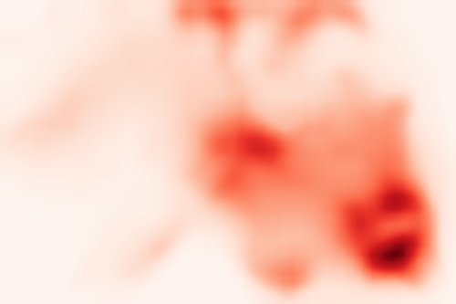

# Anti-Adversarially Manipulated Attributions for Weakly and Semi-Supervised Semantic Segmentation


Input Image   |  Initial CAM   | Successive Maps with adversarial climbing
:-------------------------:|:-------------------------:|:-------------------------:
  |   | 

The implementation of Anti-Adversarially Manipulated Attributions for Weakly and Semi-Supervised Semantic Segmentation, Jungbeom Lee, Eunji Kim, and Sungroh Yoon, CVPR 2021. [[paper](https://arxiv.org/abs/2103.08896)]

# Installation

- We kindly refer to the offical implementation of [IRN](https://github.com/jiwoon-ahn/irn).
- This repository is tested on Ubuntu 18.04, with Python 3.6, PyTorch 1.4, pydensecrf, scipy, chaniercv, imageio, and opencv-python.
## Usage

#### Step 1. Prepare Dataset

- Download PASCAL VOC 2012 benchmark: [Download](https://drive.google.com/file/d/1e-yprFZzOYDAehjyMVyC5en5mNq6Mjh4/view?usp=sharing).


#### Step 2. Prepare pre-trained classifier

- Pre-trained model used in this paper: [Download](https://drive.google.com/file/d/1G0UkgjA4bndGBw2YFCrBpv71M5bj86qf/view?usp=sharing).
- You can also train your own classifiers following [IRN](https://github.com/jiwoon-ahn/irn).


#### Step 3. Obtain the pseudo ground-truth masks for PASCAL VOC train_aug images and evaluate them
```
bash get_mask_quality.sh
```

#### Step 4. Train a semantic segmentation network
- To train DeepLab-v2, we refer to [deeplab-pytorch](https://github.com/kazuto1011/deeplab-pytorch). However, this repo contains only COCO pre-trained model. We provide [ImageNet pre-trained model](https://drive.google.com/file/d/14soMKDnIZ_crXQTlol9sNHVPozcQQpMn/view?usp=sharing) for a fair comparison with the other methods.


## Acknowledgment
This code is heavily borrowed from [IRN](https://github.com/jiwoon-ahn/irn), thanks [jiwoon-ahn](https://github.com/jiwoon-ahn)!